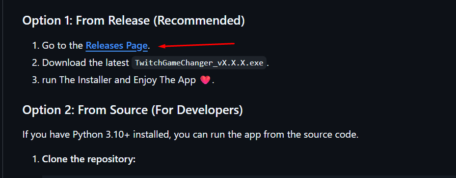
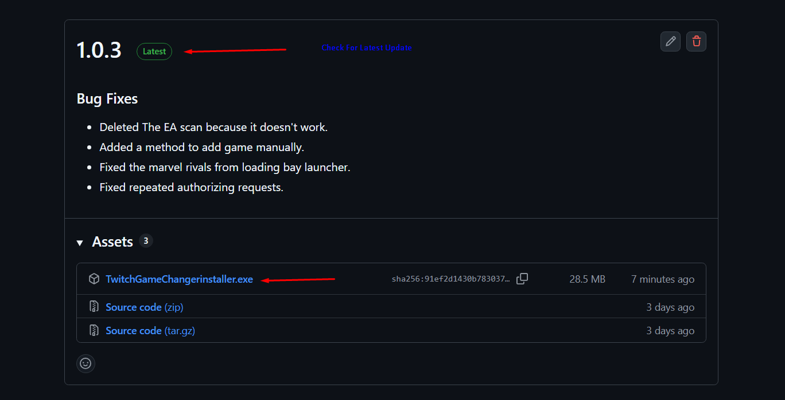
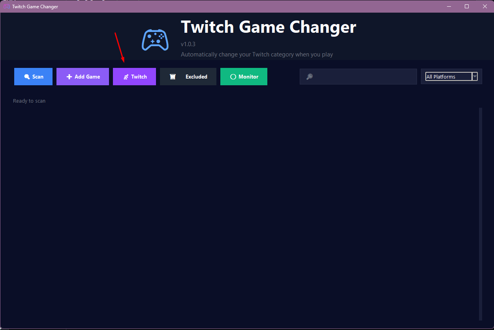
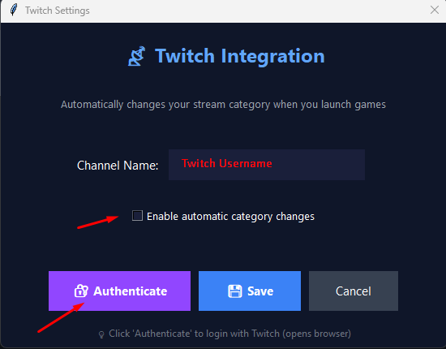
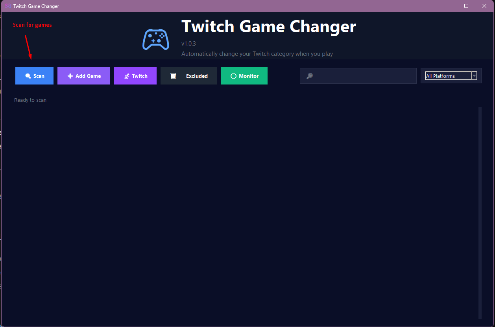
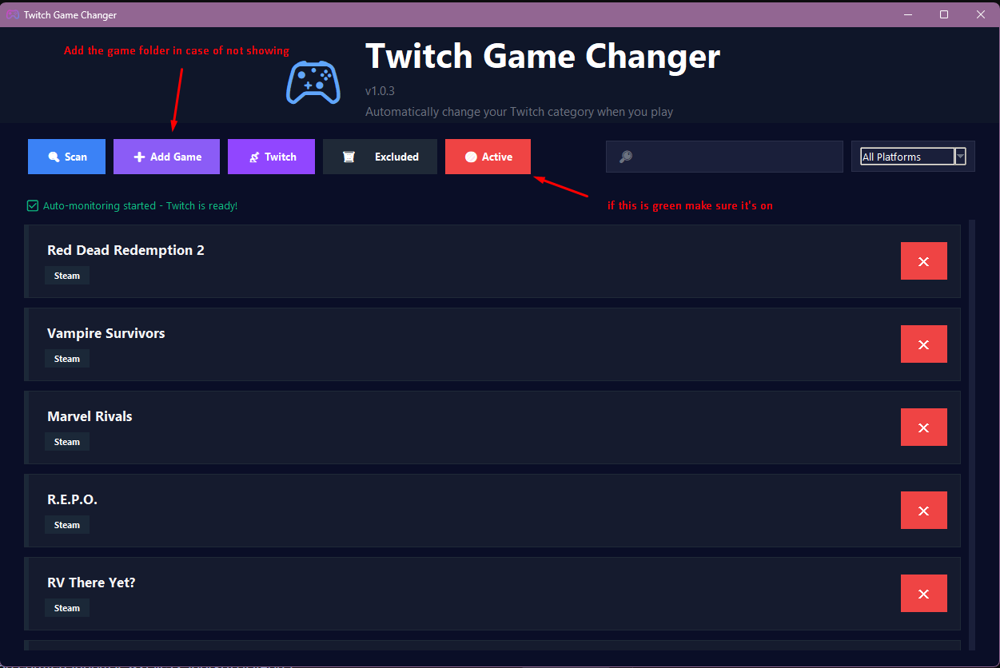

# 🎮 Twitch Game Changer

**Automatically update your Twitch stream category to the game you're playing. No more "Forgot to change my category" moments!**

Twitch Game Changer is a lightweight, smart desktop application for Windows that scans your PC for installed games, monitors your active processes, and instantly updates your Twitch category when you launch a game. When you close it, it intelligently switches you back to "Just Chatting."

**[Instagram For Feedback!](https://www.instagram.com/m84t1/)**

---

## ✨ Key Features

* **Multi-Platform Scanning:** Automatically detects games from all major launchers:
    * Steam
    * Epic Games
    * GOG
    * EA/Origin
    * Riot Games
    * Battle.net
    * Xbox
* **Smart Category Matching:** Uses the Twitch API to find the *exact* category for your game. If no game is running, it defaults to **"Just Chatting."** If a game is detected but not listed on Twitch, it falls back to **"Games + Demos."**
* **Secure Authentication:** Uses the official Twitch Device Flow for authentication. Your sensitive access tokens are **encrypted and stored locally** on your machine using machine-specific keys.
* **Full Game Library Management:**
    * Beautiful UI displays all found games with their icons and platform.
    * Search your library by name.
    * Filter by platform (e.g., show only Steam games).
    * Exclude games (like "wallpaper.exe" or test clients) you don't want to track.
    * A dedicated "Excluded Games" manager to restore games you've removed.
* **Efficient Background Monitoring:** Runs quietly in your system tray using minimal resources (`psutil` for process checking).
* **Resilient Tray Icon:** The system tray icon is designed to automatically recover and reload if Windows Explorer restarts (a common issue that crashes many tray apps).
* **Run on Startup:** Includes a `--startup` launch flag so you can add it to your Windows startup folder and have it run minimized automatically.

## 🚀 Installation

### Option 1: From Release (Recommended)

1.  Go to the **[Releases Page](https://github.com/abdullah-alk/Twitch-Game-Changer/releases)**.
2.  Download the latest `TwitchGameChanger_vX.X.X.exe`.
3.   run The Installer and Enjoy The App ❤️.

### Option 2: From Source (For Developers)

If you have Python 3.10+ installed, you can run the app from the source code.

1.  **Clone the repository:**
    ```bash
    git clone [https://github.com/your-username/your-repo.git](https://github.com/your-username/your-repo.git)
    cd your-repo
    ```

2.  **Create and activate a virtual environment:**
    ```bash
    python -m venv venv
    .\venv\Scripts\activate
    ```

3.  **Install the required dependencies:**
    ```bash
    # Create a requirements.txt file with the following contents:
    # requests
    # pystray
    # Pillow
    # pywin32
    # cryptography
    # psutil
    
    pip install -r requirements.txt
    ```

4.  **Run the application:**
    ```bash
    python TwitchGameChanger.py
    ```

---

## 💡 How to Use

* Step 1: Click on Release Page on the installation.
  
  

* Step 2: Download The Lastest version on the Release Page.
  
  

* Step 3: After installing the app, Click on the twitch icon to add your account.
  
 

* Step 4: Add your twitch username, then check the box and click authorize.
  
 

* Step 5: Click on scan to reveal all the games in your pc.
  
  

* Step 6: Enjoy the app, if the game isn't from a famous platform other than EA, add the game manually and make sure the monitor is active.
  
 
